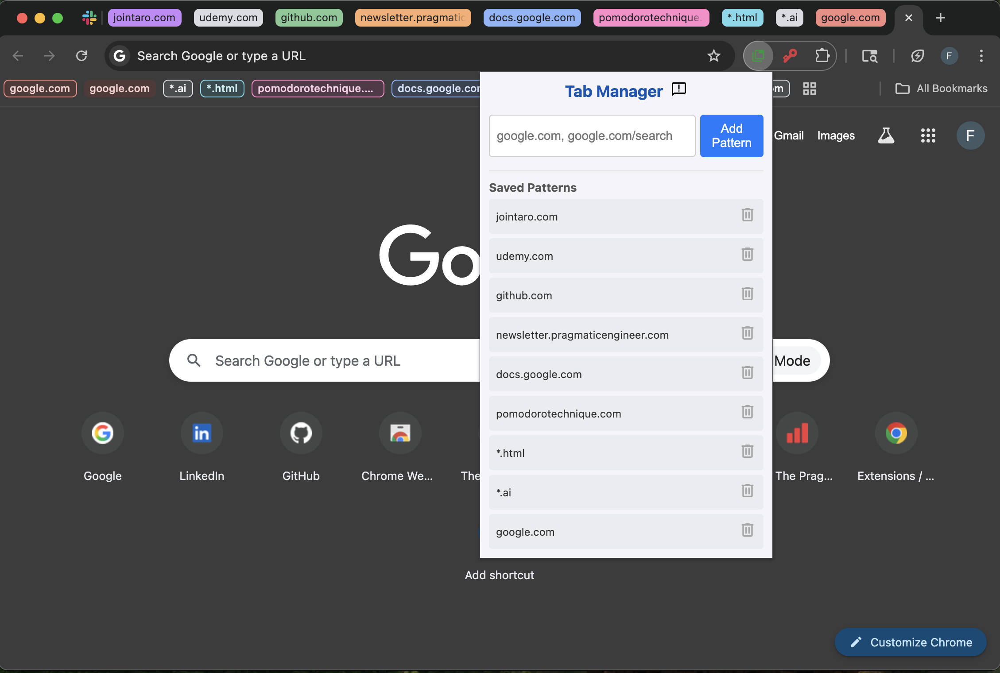
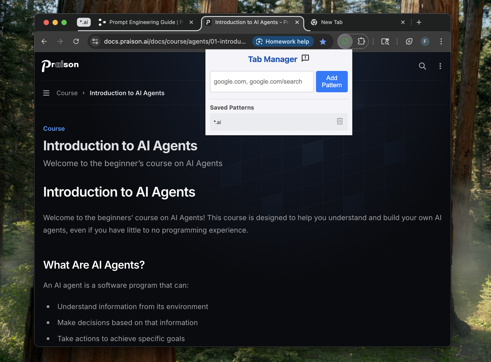

# Chrome URL Pattern Tab Manager Extension
## Easy To Use

## Fast Grouping

## Delete From List

## Group By
### Domain

### Domain/Subdirectory

### Wilcard Top-Level-Domain

### Move Unrelated Tabs Into Groups

### Move Groups To Other Windows

## Bugs and Feedback
Any reasonable feature request will be implemented within 1 week.

Will typically respond to all feedback within 1 business day with the exception of weekends and holidays.

If you encounter bugs or have ideas for new features, please share them at https://github.com/FVPukay/url-pattern-tab-manager/issues

Thanks in advance for helping improve the extension!